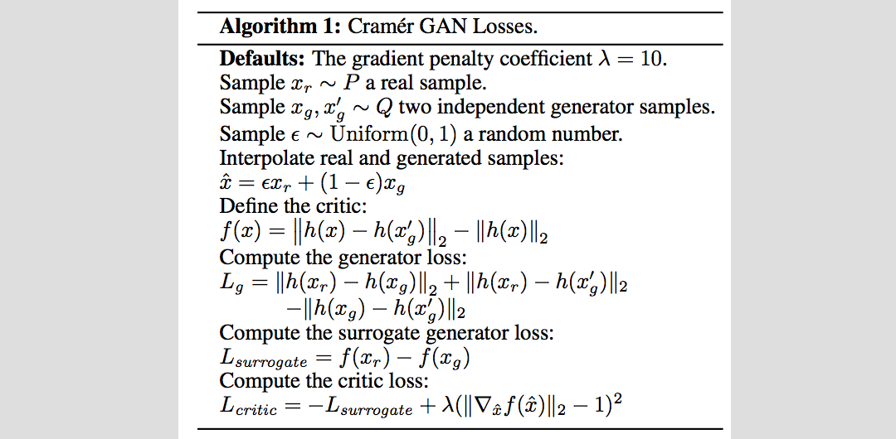

## Cramer GAN


Another recent member in the GAN family!

Seems to be an improvement over Improved WGAN (Improved^2 GAN)?

### preparations
1. `mkdir logs/mnist/`

To run an example for MNIST generation:

```
python cramer-gan.py
```

This is a modification of Improved WGAN, where the losses are changed according to the following:



